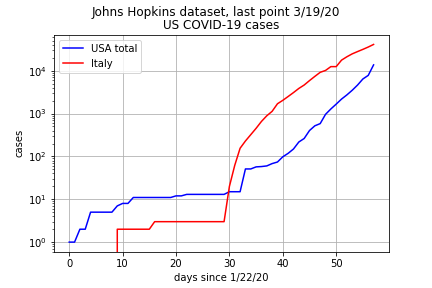
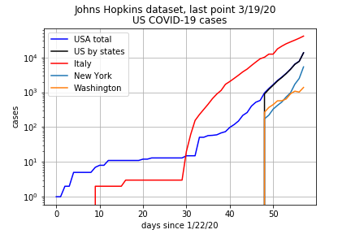

# sane-covid-19-graph
A Jupyter/Python 3 notebook for sanely and scientifically graphing COVID-19 data
from the Johns Hopkins set at the Humanitarian Data Exchange (HDX).

Plots confirmed cases on a graph with logarithmic vertical scale. _It is only as
good as the data_

